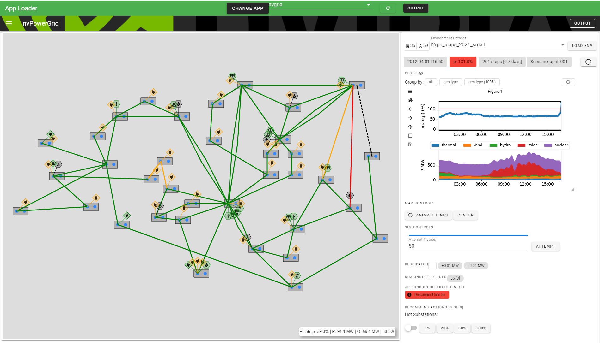
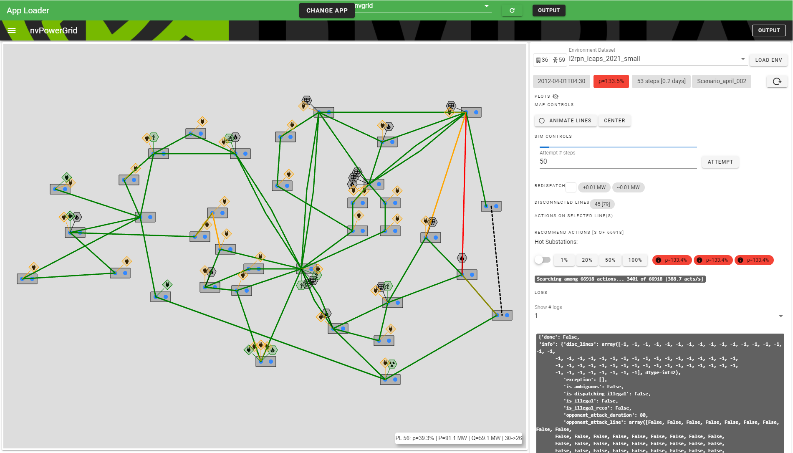

# nvgridui

Visualization and control tool for problems related to the [L2RPN competition](https://l2rpn.chalearn.org/).

## Setup

Create a new virtual environment and populate it

```
python -m venv nvgrid-env
source nvgrid-env/bin/activate

pip install wheel
pip install -r requirements.txt
```

## Snapshots

The easiest way to start the interface is to run

```
sh start-app.sh
```

and then open http://localhost:8866 in a modern browser (Chrome, Edge).




